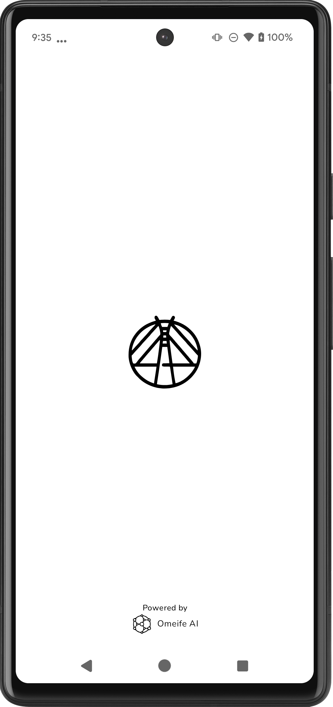
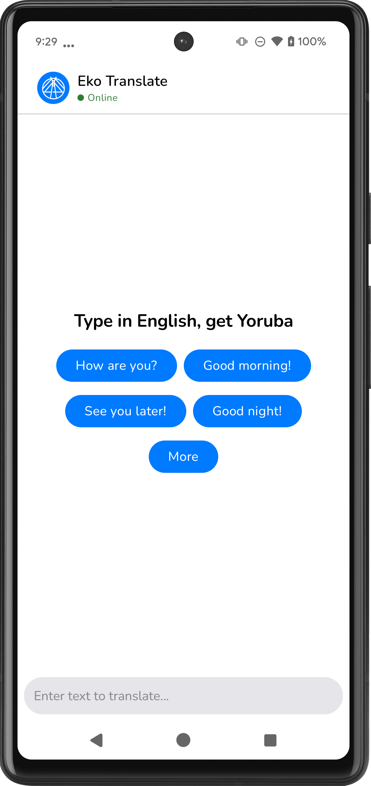
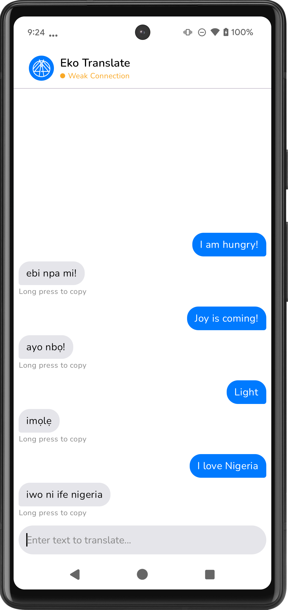
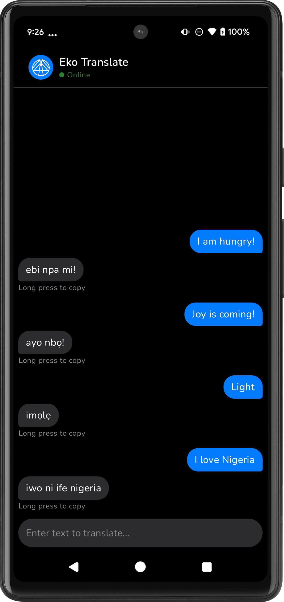

#  Eko Translate

[](LICENSE)
[](https://android-arsenal.com/api?level=24)
[](https://kotlinlang.org/)
[](CONTRIBUTING.md)

**Eko Translate** is an AI-powered English-to-Yoruba translation application designed to bridge communication gaps in Lagos, Nigeria. Leveraging Omeife AI's advanced natural language processing capabilities, Eko Translate delivers accurate, contextual translations through an intuitive chat-based interface.

## Overview

Lagos, Nigeria's economic and cultural center, presents communication challenges for non-Yoruba speakers navigating local markets, transportation, and communities. Eko Translate addresses this need with a lightweight, accessible solution for real-time translation assistance.

## Features

- **Real-time Translation Engine** - Powered by Omeife AI for accurate English-to-Yoruba translations
- **Conversational UI** - Natural chat interface for intuitive interaction
- **Smart Suggestion System** - Context-aware quick reply options to streamline common interactions
- **Network Status Monitoring** - Color-coded connectivity indicators with graceful offline handling
- **Accessibility Focus** - Designed with accessibility guidelines for broad usability
- **Coming Soon: Audio Pronunciation** - Text-to-speech functionality for Yoruba pronunciation assistance

## Installation

### End Users

Download the latest stable release:

[](https://github.com/abgolor/building-with-omeifeAI-hackathon/releases/latest)

### Developers

```bash
# Clone the repository
git clone https://github.com/abgolor/building-with-omeifeAI-hackathon.git

# Navigate to project directory
cd building-with-omeifeAI-hackathon

# Open with Android Studio
```

## Development Environment

### Prerequisites

- Android Studio (Giraffe or later recommended)
- Minimum SDK: API Level 24 (Android 7.0 Nougat)
- Target SDK: API Level 34 (Android 14)
- JDK 11 or higher
- Kotlin 2.0.21+

### API Configuration

To integrate with the Omeife AI translation service:

1. In `local.properties` (preferred, not version controlled):
```properties
OMEIFE_API_KEY=your_api_key_here
```

2. Alternative: In module-level `build.gradle`:
```gradle
android {
    defaultConfig {
        buildConfigField "String", "OMEIFE_API_KEY", "\"your_api_key_here\""
    }
}
```

## Architecture

Eko Translate implements a Clean Architecture pattern with MVVM presentation layer:

- **Presentation Layer**: MVVM with Jetpack Compose
- **Domain Layer**: Use cases and business logic
- **Data Layer**: Repositories and data sources
- **Core**: Common utilities and extensions

Key technologies:
- Kotlin Coroutines for asynchronous operations
- Retrofit for network requests
- Room for local caching (optional)
- Hilt for dependency injection

## Screenshots

<table>
  <tr>
    <td></td>
    <td></td>
    <td></td>
    <td></td>
  </tr>
  <tr>
    <td align="center"><b>Splash Screen</b></td>
    <td align="center"><b>Quick Suggestion Screen</b></td>
    <td align="center"><b>Light Mode Chat Screen</b></td>
    <td align="center"><b>Dark Mode Chat Screen</b></td>
  </tr>
</table>

## Acknowledgments

- **Omeife AI** - For providing the translation API and supporting African language technologies
- **Contributors** - See [CONTRIBUTORS.md](CONTRIBUTORS.md) for a list of project contributors

## Documentation

For detailed documentation, please refer to the [Wiki](https://github.com/abgolor/building-with-omeifeAI-hackathon/wiki).

## Contributing

We welcome contributions from the community! Please see our [Contributing Guide](CONTRIBUTING.md) for details on how to get involved.

## Security

Please report security vulnerabilities according to our [Security Policy](SECURITY.md).

## License

Eko Translate is licensed under the MIT License - see the [LICENSE](LICENSE) file for details.